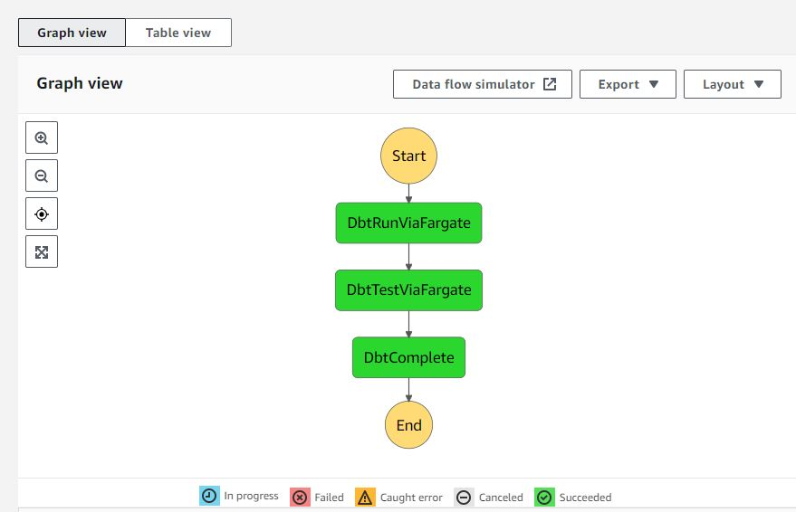

# dbt-fargate-poc-with-secrets-manager
An attempt to POC orchestrating dbt via a Step Functions State Machine that runs a Fargate task with Snowflake credentials coming from AWS Secrets Manager

## Constructs

Creates the following constructs: VPC, ECS cluster, Fargate task definition, ECS task, State Machine.

## Workflow

The Fargate task definition points to a container at https://hub.docker.com/r/andrewwlane/dockerized-dbt-with-secrets-manager (see also: https://github.com/AndrewLane/dockerized-dbt-with-secrets-manager) whose purpose is to execute `dbt run` (or `dbt test` or `dbt debug`) and use the environment variables passed in to the first task of the state machine to pull Snowflake credential info from AWS Secrets Manager.

## Example input JSON

```
{
    "DbtSnowflakeAccount": "xxxxx.us-east-1",
}
```

## Screenshot



## Example audit records in Snowflake after successful run:

```
>select * from audit order by time desc limit 2;
+---------------------+---------------------------+-------------------------------+
| MODEL               | STATE                     | TIME                          |
|---------------------+---------------------------+-------------------------------|
| my_second_dbt_model | starting model deployment | 2022-11-16 11:30:18.021 -0800 |
| my_first_dbt_model  | starting model deployment | 2022-11-16 11:30:15.090 -0800 |
+---------------------+---------------------------+-------------------------------+
```
